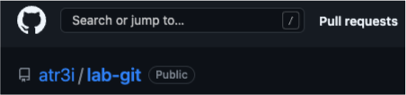

# Laboratorio Git

#### 1. Repositorio local
   
- Creo una carpeta con el nombre lab-git usando 
  ```
  mkdir lab-git
  ```
        
- Desde esta carpeta *lab-git* inicio git con 
  ```
  git init
  ```


---
#### 2. Repositorio GitHub

- Desde mi cuenta en GitHub creo el repositorio 
  ```
  atr3i/lab-git.git
  ```

- Con la ruta del repositorio [atr3i/lab-git](https://github.com/atr3i/lab-git.git), conecto el directorio local al repo remoto
    ```
    git remote add origin https://github.com/atr3i/lab-git.git
    ``` 

-  Y verifico la conexión con 
    ```
    git remote -v
    ```



---
#### 3. Commit y Push
   
- Creo el archivo README.md en el raíz del repositorio
- Lo añado al staging con 
    ```
    git add .
    ```
- Registro todo con un commit
    ```
    git commit -m "Creado repositorio y archivo README.md"
    ```
- Y para subir a GitHub ejecuto 
  ```
  git push origin main
  ```
    

    
---
#### 4. Crear rama
   
- Desde la rama main creo la rama development y me muevo a ella con 
  ```
  git checkout -b development
  ```
- Modifico el archivo README.md añadiendo la descripción del ejercicio y la carpeta images con las capturas de pantalla
- Añado los cambios y hago commit en rama development
- Hago push de la rama
  


---
#### 5. Hacer merge
   
- Desde la rama main hago el merge con la rama development 
    ```
    git merge --no-ff development
    ```
- No hay conflictos así que hago commit del merge y hago push de la rama main a GitHub


